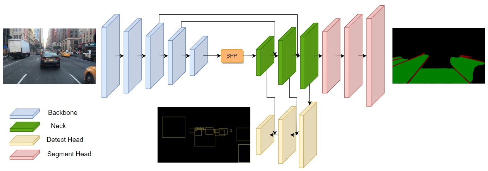

# Mobip

This repository includes the implementation of the paper -- [MobiP: A Lightweight model for Driving Perception using MobileNet](https://www.frontiersin.org/articles/10.3389/fnbot.2023.1291875/full)

### The architecture of Mobip 
 Mobip is a lightweight multi-task network that can simultaneously perform traffic object detection, drivable area segmentation, and lane line detection.  The model achieves an inference speed of 58 FPS on NVIDIA Tesla V100 while still maintaining competitive performance on all three tasks compared to other multi-task networks.



### Requirement

This code was based on python version 3.7, PyTorch 1.7+ and torchvision 0.8+:

```
conda install pytorch==1.7.0 torchvision==0.8.0 cudatoolkit=10.2 -c pytorch
```

See `requirements.txt` for additional dependencies.

```setup
pip install -r requirements.txt
```

### Data preparation
Please follow the instructions in this [link](https://github.com/hustvl/YOLOP?tab=readme-ov-file#data-preparation) to download the BDD100K dataset. Also, overwrite your path to the dataset on the DATASET related params in `./lib/config/default.py`


### Quickstart

Check the configuration in `./lib/config/default.py` and start training:

```shell
python tools/train.py
```
Multi GPU mode:
```shell
python -m torch.distributed.launch --nproc_per_node=N tools/train.py  # N: the number of GPUs
```

### Evaluation
The repository have provided a checkpoint of our trained model for demonstration.  
```shell
python tools/test.py --weights Checkpoints/model.pth
```

### Acknowledgement
The implementation of Mobip was based on [YOLOP](https://github.com/hustvl/YOLOP) and [HybridNet](https://github.com/datvuthanh/HybridNets). The authors would like to thank for their help.